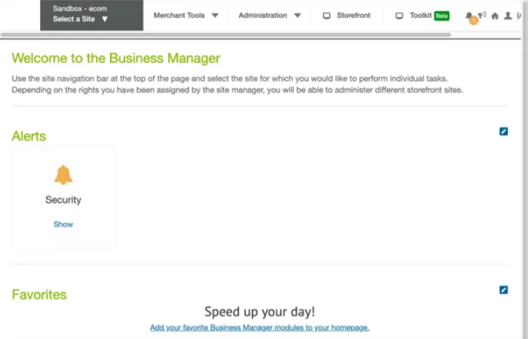
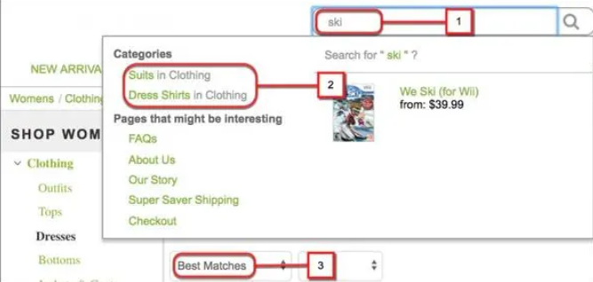
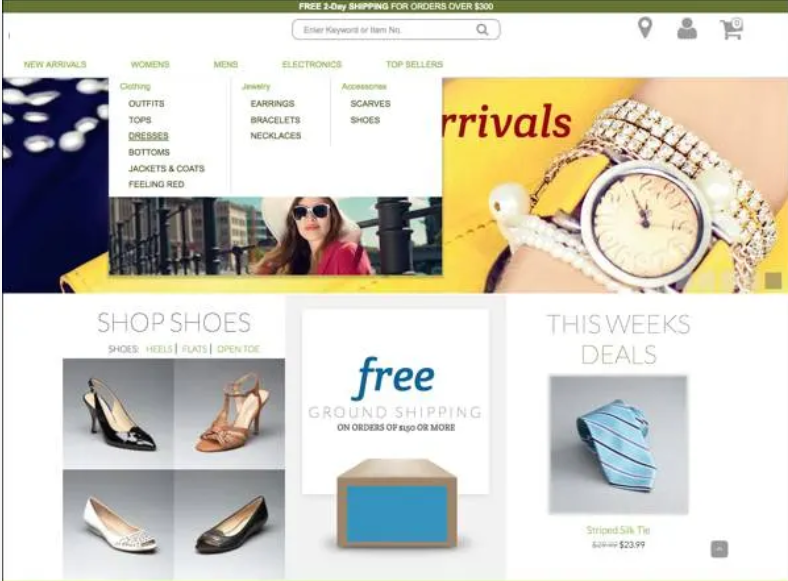
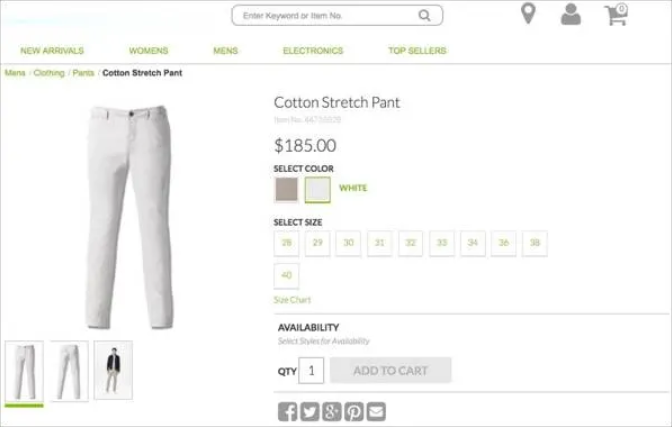
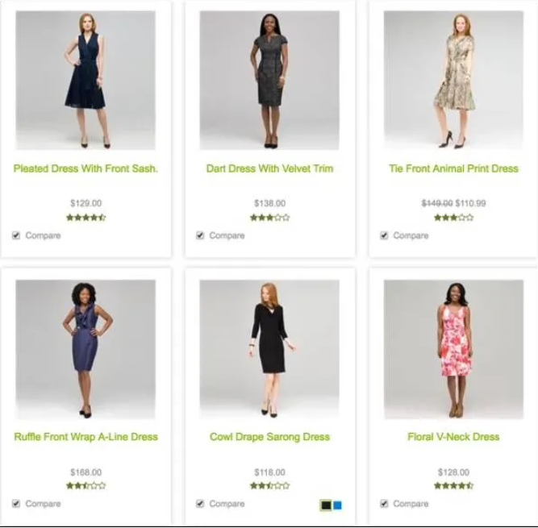
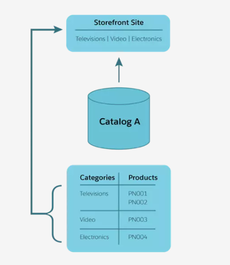
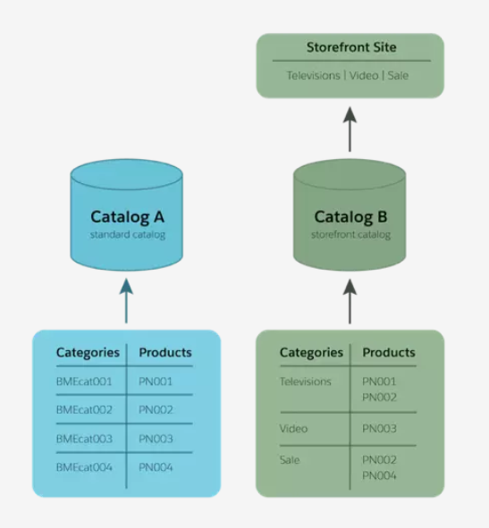

# Salesforce Basics

**Table of context:**
- [Salesforce User Basics](#salesforce-user-basics)
  - [Salesforce User Basics](#welcome-to-salesforce)
  - [Who sees what](#Who-sees-what)
  

## Salesforce User Basics

### Welcome to Salesforce

Salesforce is your customer success platform, designed to help you sell, service, market, analyze, and connect with your customers. Using standard products and features, you can manage relationships with prospects and customers, collaborate and engage with employees and partners, and store your data securely in the cloud. 

So what does that really mean? Well, before Salesforce, your contacts, emails, follow-up tasks, and prospective deals might have been organized something like this:

It’s hard to get the full picture of your prospective customer. And you certainly can’t access the data from anywhere, anytime, nor can your manager or executives see your progress on deals in flight.

Salesforce takes all of that important data and organizes it into a simple user interface. It’s one place for you to:

* Manage all your contacts
* Work with your prospective customers
* Organize tasks and to-do items
* Focus on the right deals
* Collaborate with your team
* Showcase your big wins
* Close more business

And because it’s stored on our secure cloud, you can access your data anytime, anywhere, whether you’re on desktop or mobile.

### Who sees what

Access determines your ability to open and interact with data stored in Salesforce. The data you can create, view, edit, and delete is determined by settings your admin maintains. Access can be simple or multilayered, depending the complexity of your company’s needs. The important thing you need to know is that Salesforce has options for who can see and edit data, and your admin helps to set these up and maintain them.
With the right security enabled, your whole company can be on Salesforce, and one of the best reasons to do that is to harness the power of collaboration.

### Collaboration using Salesforce

In addition to technology for managing your sales process, Salesforce includes a platform for collaboration. You can create groups, follow people and topics, ask questions, post informal polls, share files and links, and mention colleagues with whom you’d like to connect. You can also ask questions and get answers, crowdsourcing expertise from across your company. You can find experts who can help you with overcoming objections as they come up. You can search for competitive information to help you through the negotiation stage. You can get help from your leaders and teammates as you work on steps to close.

But perhaps the best part about collaborating in Salesforce is that it’s all stored for future reference. Rather than having key insights and answers to important questions living in individual email inboxes or in hallway conversations, collaboration in Salesforce is accessible and searchable. 

And because it’s in Salesforce, this is collaboration that can happen in context, right on individual deals, tasks, support issues, and more. This is the power of collaboration combined with CRM.

### What Is CRM?

CRM stands for Customer Relationship Management. This technology allows you to manage relationships with your customers and prospects and track data related to all of your interactions. It also helps teams collaborate, both internally and externally, gather insights from social media, track important metrics, and communicate via email, phone, social, and other channels.

In Salesforce, all of this information is stored securely in the cloud.

### How Salesforce Organizes Your Data

Salesforce organizes your data into objects and records. You can think of objects like a tab on a spreadsheet, and a record like a single row of data.

In Salesforce, objects are accessed via the navigation menu. Select any record to drill into a specific account, contact, opportunity, or any other record in Salesforce.

So, that’s objects, records, and more, and now you have some insight into how your data is organized in Salesforce using our spreadsheet example. But unlike an actual spreadsheet, your Salesforce data is stored in our trusted, secure cloud and has an easy-to-use interface, which you can access both from the desktop and your mobile device. So it’s similar to a spreadsheet, but in Salesforce, your data is all tracked, shared, and has apps connected to it. Salesforce comes with a set of standard objects already set up and ready for use.

### Salesforce Standard Objects
Here are some of the core standard objects you’ll be using with Salesforce, and a description of how each one is used.

* Accounts are the companies you’re doing business with. You can also do business with individual people (like solo contractors) using something called Person Accounts.
* Contacts are the people who work at an Account.
* Leads are potential prospects. You haven’t yet qualified that they are ready to buy or what product they need. You don’t have to use Leads, but they can be helpful if you have team selling, or if you have different sales processes for prospects and qualified buyers.
* Opportunities are qualified leads that you’ve converted. When you convert the Lead, you create an Account and Contact along with the Opportunity.

Salesforce CRM allows you to manage and access your data in sophisticated ways that you could never do with a simple spreadsheet. Your records can be linked together to show how your data is related, so you can see the whole picture.

## Get Started with Commerce Cloud

### What Is Commerce Cloud?

Commerce Cloud is a key part of the Salesforce Customer Success Platform and offers ecommerce solutions for B2C (business to consumer) and B2B (business to business) customers. That means that organizations purchase Commerce Cloud to provide the best ecommerce websites to their customers who are shopping online—whether they are consumers buying the latest fashion or businesses making a large wholesale purchase.

Commerce Cloud was created in July 2016, when Salesforce acquired Demandware, an industry leader in ecommerce sites and solutions designed with the shopper in mind. The Demandware technology has grown and evolved to become the Salesforce B2C Commerce product.

In 2018, Commerce Cloud expanded beyond B2C ecommerce with the acquisition of CloudCraze, a leader in ecommerce designed for organizations selling to business customers. What was CloudCraze is now the Salesforce B2B Commerce product.

Now Commerce Cloud spans across B2C and B2B to offer leading ecommerce solutions for all types of companies looking to sell products and services online.

### What Are the Commerce Cloud Products and Capabilities?

Commerce Cloud features two core capabilities: B2B Commerce and B2C Commerce.

#### B2B Commerce
Consumers aren’t the only ones buying online. Businesses need to make purchases too. For example, a wholesaler can place an order of merchandise to stock multiple stores for an entire season, or a factory can purchase replacement parts for a specific type of machine. B2B Commerce powers sites for many of the world’s largest companies that span manufacturing, consumer goods, technology, healthcare, and more.

These sites are designed for extremely large carts and purchases consisting of hundreds or thousands of items. They include B2B-specific functionality such as:

* Authenticated sites, including logins for each visitor
* Shopping carts that can accommodate hundreds of items per order
* Two-click reorders to make large, frequent orders fast and easy
* Custom storefront themes for a unique look and feel for each account
* Specific product catalogs by account for a selected subset of products
* Negotiated/contract pricing by account or by customer segment
* Complex shipping functionality allowing for multiple delivery dates and locations
* Multiple payment types like credit card, purchase order, and ACH

#### B2C Commerce

B2C Commerce lets brands create and coordinate shoppers’ online experiences and transactions across digital channels and devices. Web and mobile sites are a huge part of the online experience. Brands can launch and manage responsive ecommerce sites—for web and mobile—that have rich online storefronts, shopping cart and checkout functionalities, and full customization capabilities.

For many retailers, one site isn’t enough. When retailers have more than one brand, or when they sell in multiple countries, they typically need different sites for each brand and geography. Commerce Cloud lets retailers launch sites for multiple brands and geographies and then manage them all in a single place.

But shoppers don’t just visit web and mobile sites, they also interact with brands through email, social media, and in stores. By integrating their ecommerce sites with their marketing and service solutions, brands can make every email and social media interaction more personalized and relevant to shoppers. And by bringing ecommerce into the store through kiosks or store associate application they can provide shoppers with improved service and access to more inventory than what is available in store, often helping to “save the sale!”

##### Einstein for B2C Commerce
Einstein for B2C Commerce features are directly embedded into B2C Commerce to empower marketers and merchandisers to use AI without having to hire a data scientist. Using the wealth of their commerce data, they now have the power to make smarter decisions and supercharge personalization across commerce journeys.

Einstein intelligence powers five key B2C Commerce capabilities: Einstein Product Recommendations, Einstein Predictive Sort, Einstein Commerce Insights, Einstein Search Dictionaries, and Einstein Search Recommendations.
  
##### Order Management for B2C Commerce
Order Management for B2C Commerce gives brands full visibility into orders and inventory data. Self-service tools for shoppers, and smart up-sell and cross-sell opportunities for service agents inspire shopper loyalty and drive revenue for companies.

With Order Management, merchants can leverage the extensibility of the Salesforce Platform to design complex processes with flow, and connect effortlessly to logistics partners via the AppExchange and MuleSoft. This gives companies the flexibility to ship from anywhere, creating efficiencies that save time and money.

##### Endless Aisle for B2C Commerce
Endless Aisle for B2C Commerce provides brands with physical stores the ability to offer shoppers limitless product choice and eliminate lost sales by extending digital commerce into the store. Brands can offer to sell and ship any product to their customers, regardless of its location—helping to deliver product faster and more cost effectively. And brands can also empower store associates with real-time access to digital inventory.

### Why Does Commerce Cloud Need Different Products for B2B and B2C Commerce?

Commerce sites built for business users (B2B) are designed for a smaller set of known customers who often make large or frequent purchases. For example, a chemical manufacturer can sell to 1,000 factories that reorder each month. B2B sites need to make it easy for customers to make large orders, and then reorder the right products quickly.

Commerce sites built for the consumer (B2C)—the kind that all of us use for regular online shopping—are designed to attract a large number of guest shoppers to the site. Once a shopper is on the site, companies want to show them the most relevant products, let them quickly add a few (or several!) products to their cart, and then pay and finish the transaction quickly. It’s important for B2C sites to scale for big sales or holidays when millions of shoppers can be on the site at the same time.

### The Key Categories of B2C Commerce

B2C Commerce is broken down into these categories:

* Commerce Storefront
* Merchandising and Marketing
* Multi Site Management and Localization
* B2C Commerce Extensions

#### B2C Commerce Storefront

The B2C Commerce storefront is essentially an ecommerce site. But it’s so much more than just a website with an online cart. Brands can differentiate, manage, and customize shoppers’ ecommerce experience.

Capabilities include the Storefront Reference Architecture (SFRA), a robust reference architecture that helps brands build and launch sites quickly and easily using mobile-first best practices. While each site has its own feature-rich storefront, retailers can use the reference architecture to create it. It sits outside the platform API layer and is fully customizable. It lets you create storefronts that support multiple languages and currencies. It provides a modern shopping cart and checkout that features Save for Later (to save an item to a wishlist for a logged in user), optimized user flows, Apple Pay, and other wallet options to make the checkout process as fast and seamless as possible.

Capabilities also include prebuilt integrations to extend site functionality, and open APIs so that your site can connect to any third-party data or applications like user reviews.

#### Merchandising and Marketing

Merchandising and Marketing capabilities in B2C Commerce draw on the power and insights of AI, giving retailers limitless opportunities for personalized engagement with their customers. These capabilities help brands fuel ecommerce growth with features that empower:

* Product, pricing, and catalog management, so that marketers and merchandisers can sync products and pricing across categories, catalogs, currencies, and sites
* Merchandising and promotion management, to quickly launch campaigns and promotions
* Site search and guided navigation that help online shoppers zero in on the perfect product
* Faster AI-powered personalization that uses machine learning to deliver personalized offers and product recommendations

#### Multi Site Management and Localization

Global retail brands need unique, localized sites for each market. B2C Commerce is a leader in internationalization and helps customers easily create and manage additional, geo-specific sites that encompass different customs, cultures, currencies, and languages. For example, a retailer focusing on the United States, France, and Germany is most likely to have a unique website dedicated to each country. Brands can target their content, offers, and products by language, country, region, state, or city.

Multi Site Management also empowers regional marketing teams with a global reference storefront that lets them build and launch sites quickly with multi-lingual, multi-currency logic. Plus, user interfaces are available in English, Chinese, Japanese, French, Italian, Korean, and Portuguese

#### B2C Commerce APIs

B2C Commerce APIs take brands beyond the website to use digital capabilities across social, mobile, and even in-store channels. These include:

* APIs to connect with third-party applications
* Social media extensions, to extend commerce into social channels and online communities, such as Instagram and Facebook
* In-store endless aisle and “clienteling,” to help in-store shoppers find the item they need, even if it’s not available at that specific store location. (This is a reference app that uses B2C Commerce customer, product, and inventory data to enable store associates to access this information to complete sales in the store.)

### Einstein for Commerce

Einstein for Commerce features are directly embedded into Salesforce B2C Commerce to delight shoppers, make merchants more productive, and most importantly—grow revenue. This is all achieved through AI and machine learning, using their own wealth of commerce data.

#### Einstein Product Recommendations

Product Recommendations uses machine learning to make suggestions personalized to a consumer’s shopping experience. Whether a shopper is a guest or known—that is, signed in to an account—these recommendations suggest the most relevant products throughout a consumer’s shopping journey to keep them engaged on the web site, and help them browse more efficiently.

Merchants can choose from multiple recommendation types. They can use traditional recommendations that show like-for-like products, for example, where a shopper sees blue shoes recommended on a product detail page for another pair of blue shoes.
Einstein Product Recommendations present customers with the right products at the right time. They encourage more purchases and maximize a brand’s revenue. But they do something else that’s just as important, if less quantifiable. They offer each customer a delightful shopping experience through personalized—perhaps even thoughtful—attention to their interests, based on the items they themselves have shown interest in.
 And happy shoppers are good for business.

#### Einstein Predictive Sort

With Einstein Predictive Sort, brands can automatically personalize the order of products shown on each search results or category page. This means products most relevant to a shopper show up first based on their past browsing and buying behavior. Predictive Sort makes the web experience more enjoyable since shoppers don’t have to scroll through as many products and pages to find items of interest.

It’s even more impactful for shoppers using a mobile device. Mobile screens typically show fewer products per page, and shoppers don’t like to click and scroll through several pages to find what they’re looking for. Einstein Predictive Sort is a simple way to make the mobile shopping experience faster and more seamless.

#### Einstein Search Recommendations

Einstein Search Recommendations powers personalized type ahead search guidance for each individual shopper on site. This Google-ifys the brand’s site search so that shoppers are automatically guided to the best search terms for them.

For example, if one shopper starts to type the letter s, she might see the word sandals autocomplete for her. This is based on her past shopping and browsing history. If another shopper types the letter s, he might see the word sneakers autocomplete based on his history.

#### Einstein Commerce Insights

Einstein Commerce Insights empowers merchandisers to interpret purchasing behavior using a powerful shopping basket analysis dashboard. Merchandisers can choose key items in their inventory and learn which products shoppers most commonly purchase along with them. Merchandisers can drill into data on specific products based on date range, and gain insight into metrics such as product-specific sales and top “co-purchase” categories.

#### Einstein Search Dictionaries

Einstein Search Dictionaries consumes all the site searches and surface terms that are used in searches, but not yet in the retailer’s keyword list. It then makes recommendations to merchandisers, for example, synonyms that can be added to the list. Before, if retailers wanted to find missing search terms and pick the synonyms list to add them to, they had to sift through a long spreadsheet and guess which one they wanted.

Einstein Search Dictionaries analyzes data across B2C Commerce to find relationships between search terms, and then recommends the synonym list to add them to. For example, a shopper searching for “mauve sweater” might not get any results. But Einstein Search Dictionaries, seeing a potential relationship—mauve being sort of pink—will recommend adding “mauve” to the synonym list for “pink” and “purple.” Now, a shopper looking for a "mauve sweater" might see exactly what they want. The benefits for shoppers and retailers are clear. Shoppers aren’t disappointed, coming away empty-handed when they can’t find the stuff they want. Retailers benefit in multiple ways: by not losing a sale to a customer who can’t find what's actually in stock, and by reducing some of their workload so they can focus on other important site merchandising tasks.

### Learn About Commerce Cloud Order Management

Order Management for B2C Commerce gives retailers an all-inclusive view of customers, orders, returns and exchanges, inventory, products, and promotions across physical and digital channels. This feature helps retailers process orders and optimize their inventory—and so much more.

If you’ve bought anything online, you probably relied on an order management system when you checked on your order or even looked up previous orders. But Order Management also drives more complex, “cross-channel” transactions. Have you ever bought something online and then picked it up in the store? Or returned to a store an item you bought online? You were engaging in a cross-channel transaction, a shopping experience that is becoming more and more popular with consumers.

Order Management, an add-on to B2C Commerce, shares order data in real time with B2C Commerce. That's why it's "for B2C Commerce!"

#### Capabilities of Commerce Cloud Order Management for B2C Commerce

* Enterprise Inventory

At the core of every successful shopping experience is an accurate view of the inventory that’s available for sale. Enterprise Inventory makes all available inventory visible—whether it's in stores or in distribution centers—in a single, authoritative available-to-sell record. So all selling and service channels have an accurate representation of sellable inventory no matter where it sits. This makes more units of inventory available to shoppers, rather than just the units sitting in an individual area or store. It also prevents over sells, which can frustrate consumers and retailers alike.

* Distributed Order Management

The Order Management engine, sometimes called Distributed Order Management, encompasses all of the sophisticated logic that it takes to allocate items, fulfill an order and manage the entire order life cycle. This baked-in intelligence means retailers can accept orders and returns from multiple selling channels—online, mobile, in-store. Retailers can process invoices, payments, and sales tax. And it lets retailers set allocation rules for backorders, preorders, split orders, and drop-ship orders to ensure each and every one is fulfilled cost-effectively and efficiently.

* Store Fulfillment

Mobile optimized, real-time tools for retailers let store associates quickly and easily handle fulfillment requests that are ready for shipment. The Store Fulfillment feature also enables retailers to have products at the ready for a customer who wants to pick items up in-store.

* Customer Service

The customer service features of Order Management enable universal order intervention. From any channel—phone, web, store, even customer self-serve—customer service reps have a complete view of shoppers, the product catalog, inventory, and orders. So reps and associates can provide the best possible service when they handle order inquiries or modifications.

* Complete Order Data

With Order Management, retailers have access to order information at all stages of the process, from where and how the order was generated to where and how it is being delivered. This gives retailers more control and visibility into each individual unit of merchandise from the moment of purchase to the moment of delivery.

### Learn About B2B Commerce

While Salesforce B2C Commerce focuses on online retail shoppers, there’s another whole area of ecommerce with its own demands and capabilities—B2B—business to business.

Salesforce B2B Commerce enables organizations to create ecommerce storefronts that are specifically designed for businesses making large volume purchases from other businesses online. B2B commerce customers need easy online access to suppliers so they can buy products to run their businesses.

 
## Salesforce B2C Commerce (Explore how B2C Commerce transforms the online shopping experience)

### B2C Commerce Shopping Experience

In this module, you’ll learn what ecommerce is and how B2C Commerce helps you delight the customers who buy your products online. After you earn this badge, you’ll better understand what your stakeholders—partners, admins, developers, and merchandisers—are talking about when they talk about B2C Commerce.

We build B2C Commerce storefront applications with the shopper in mind. We want shoppers to get what they want, return again and again, and tell their friends and family what a great experience they had. Providing an online shopping experience that’s fun, fast, and easy makes everyone happy.

#### The Shopper’s View

Let’s say you’re treating yourself to a tropical vacation next month. You’ve done a little surfing on other vacation trips, and you’re curious about riding the waves in a new location. Maybe you’ll discover when you get there that the waves are a tad out of your league. Maybe you’ll go to nice quiet reef instead and play with the tropical fish and the green sea turtles.

Whatever you do, you’re going to have a great time, and you need some fabulous gear!

You take a deep breath, log in to your smartphone or computer, and open a cool site called BeachCloud that sells beach products.

You click the Apparel tab, then the tile that says Bathing Suits. There are other tabs, such as Accessories, but you ignore those for now.

Like many B2C Commerce storefronts, the BeachCloud site organizes products by category, and each category has a tab. When you click a tab to see products in that category, you’re navigating the site.

You don't see what you want, so you enter stripd bathing suit into the search field. Woops, typo!

But then you see a page that asks if you really meant “striped bathing suit.” And there’s a link.

This is called searching.

You click the link and a pink striped bathing suit displays on the very first page. It’s just what you’re looking for.

You hover your mouse over the image and it zooms in, showing more details. You’re viewing product content.

You click a video link and see a model wearing the suit and moving so you can see it from different angles. The video is also content.

The suit looks just right. You select your size and click Buy.

Now you’re on a roll. You click the Accessories tab and see tiles for footwear, towels, and sunglasses. You click the Towels tile and select a big, thirsty-looking towel with bright stripes, then click Buy.

You spy a panel at the top of the page that says, “All Surfboards Half Off.”

This is a promotion with a fabulous discount.

It’s your lucky day. You click the panel to open a page showing a whole lot of surfboards. You pick one with red and pink stripes and click Buy.

You go back to your cart and view your new list, which now includes the flip-flops.

You didn't know it when you made your original choices, but the bathing suit comes with a free bag. There’s a link to choose the bag you want beneath the bathing suit line item. You click the link, pick the yellow bag, and click Choose. Your bag is now listed beneath the bathing suit in the cart.

Checkout is fast and easy.

You enter your name and address, click Same as Billing, enter your credit card information, and select a shipping method. Because you’re in no rush, BeachCloud waives the shipping fee. Your order looks great, and you have free shipping. You’re happy. You click Place Order.

You’re back at the front page and you spy a pair of goggles. It’s too late to add to your order now, but maybe you’ll add the goggles to your wish list. You wonder if you should create a BeachCloud account so you get more cool deals that help you save up for your next vacation.

People who create accounts at an ecommerce site can log in whenever they shop there. Logged-in shoppers have special privileges like wish lists and saved payment information that save them time and make them feel special.

Now, all you have to do is start packing for your trip.

### B2C Commerce Features

Lots of retail companies sell their products online—in fact most do. But finding the right tools and services to make ecommerce dreams come true can be daunting. That’s where B2C Commerce comes in. What is B2C Commerce, and how can you relate it to what you already know about online shopping?

B2C Commerce is a set of tools, services, and processes that you use to configure ecommerce sites. Whether your customers are browsing on their desktop or a mobile device, we’ve got you covered. It’s about product details that help shoppers make decisions, targeted discounts, speedy checkout, and underlying tools that track behavior and data. Lots of features come standard, and the B2C Commerce open development environment lets you customize or extend it further.

In B2C Commerce, a site is the application and associated code that runs a storefront, where shoppers go to buy things online. You can sell your products internationally if you want, because B2C Commerce data and storefronts are localizable. B2C Commerce supports both language- and country-specific locales.

If you create or maintain B2C Commerce sites, you’re probably a merchandiser, administrator, or developer. Merchandisers create marketing campaigns and work with site data such as product details, images, and search. Administrators configure sites and make sure they run properly. Developers develop the sites. This module is designed mainly for merchandisers, but if you’re an admin or a developer, you’ll find information here that’s helpful for you, too.

Let’s start by learning about the B2C Commerce standard features: search, navigation, product, content, discounts, logged-in users, and checkout. You configure these features in Business Manager, an online B2C Commerce tool for anyone who creates and maintains B2C Commerce sites.

#### How Shoppers Find Your Stuff and Navigate Your Storefront

Good ecommerce search and navigation help shoppers find what they want fast. You want shoppers to find what they’re looking for, buy it, and keep coming back.

Here are some key terms you should know.

* Keyword Search—The shopper types a word in the search field.
* Search Suggestion (aka search-as-you-type)—After the shopper types the first few letters of a word, B2C Commerce displays a list of clickable suggestions.
* Search Results—The site displays clickable product tiles or a list of products that fit the search criteria.
* Navigation—The shopper clicks tabs or breadcrumbs to get closer to the products they want.
* Storefront Sorting—The shopper selects from a menu to change which products appear first in the search results.
* Search Refinement—The shopper selects price range, color, and size to narrow the search.
* No Results Found—This page opens when there are no results.

#### How You Showcase Your Products

While search is where a shopper types text into a search field to find something, navigation is when they click on category tabs or select subcategories to navigate the site. In the BeachCloud storefront we talked about in the previous unit, our imaginary shopper clicked the Accessories (category) tab and then the Footwear (sub-category) tile.

B2C Commerce organizes sites using categories. A catalog is a container for categories, and a category is a container for products. Each product is identified by an SKU or part number. Other information about the product includes size, color, specifications, brand, price, graphics, and videos. Videos are typically supported outside B2C Commerce, such as with a content delivery network (CDN).

You can configure products as masters and variants. For example, each variant of the master product can specify a unique size and color, with corresponding graphics.

Product sets are where your shoppers can buy a group (set) of products or individual products in the set. For example, they can order a wardrobe—pants, shirt, and hat—all together or separately. Product bundles are multiple products that are orderable only as a unit, such as a gaming bundle that includes a video game console and several games.

#### How Shoppers Compare Your Products

After searching for an item, shoppers see a search results page where they can click a tile or an item in a list.

To make it easy for shoppers to compare products, the product details are consistent. Graphics and video are in the same place, the list of product information has the same format and information types, and pictures display in standard sizes. Consistency improves your shoppers' experience because they can focus on the differences between products, not the difference between page elements.

#### How You Give Shoppers a Discount

Getting a discount feels awesome! You use Business Manager to create all kinds of discounts for your customers. Start by creating qualifiers, then promotions, and then campaigns.

A qualifier is a condition that shoppers must meet to be eligible for a discount. These are qualifiers.

* Coupons support direct marketing efforts. You can create single-use coupons and coupons that shoppers can use more than once.
* Customer groups can be a list of specific customers or customers that meet certain criteria such as age and geographic location.
* Source codes are available via a link on an affiliate website. Shoppers search on one site, click a link, and are directed to another site. A qualifier code in the cookie provides the discount at the second site.

In Business Manager, you can create three types of promotions.

* Product—Give shoppers a free or discounted product.
* Order—Give shoppers a discount on their order.
* Shipping—Give shoppers a discount or an upgrade on shipping.

A B2C Commerce campaign contains one or more experiences that shoppers have in your storefront. In this module, we focus on the promotion experience. You can create a spring campaign, for example, that offers 10% off on pants, 20% off orders over a specified amount, and free shipping. You configure each discount in a promotion, then configure each promotion as an experience within a campaign.

#### How You Reward Logged-In Users

Shoppers who create an account on your ecommerce site and log in when they shop are loyal buyers. You can reward their loyalty by giving them special discounts or providing services such as wish lists, gift registries, detailed order history, and delivery tracking. You can also store credit card data and addresses so logged-in shoppers can check out and pay faster.

#### How Your Shoppers Check Out

After shoppers select the items they want to buy, they check out and pay for their purchases. This process should be easy and fast.

Helping your shoppers check out fast means collecting key information from them as painlessly as possible. B2C Commerce lets you do that by minimizing the number of pages in your checkout flow and the number of buttons or links a shopper has to click—anything that can detract from the buying experience and prevent a sale.

#### Third Party Integrations

B2C Commerce comes with all the standard features we’ve looked at so far in this module. Through the Salesforce B2C Commerce LINK Technology Program, B2C Commerce also integrates with third-party applications that handle processes such as tax calculation, shipping carriers, and payment providers.

## Salesforce B2C Commerce for Merchandisers ( Configure product listings, make them easy to find, and give shoppers discounts they love. )

### B2C Commerce Product Data

In this unit, we discuss how catalogs, categories, products, content, and libraries work in your organization’s B2C Commerce storefront.

A quick word about organizations, sites, and storefronts. Your organization contains your sites, and each of your sites can contain one or more storefronts. Your organization can have:

* One site with one storefront
* One site with multiple storefronts
* Multiple sites and multiple storefronts

#### Catalogs

A catalog is a collection of categories, products, and images. Your company can have one or many catalogs. You can only assign one catalog—the storefront catalog—to your site.

When we talk about sites in B2C Commerce, we mean the application and associated code and configurations that represent one or more storefront URLs. Storefront is the term we use for a B2C Commerce website, but we also use the term to describe any online ecommerce experience, such as a native application on a mobile device. A storefront is the place shoppers go to buy stuff!

In the storefront catalog, the category structure you create determines storefront navigation: the categories that group products, the products available in each category, and the product attributes displayed to the shopper.

Product attributes are the information types you define for each product. For example, product attributes for shoes include size, color, heel height, width, and brand. When you define attributes for the Shoes category, all products in that category have those attributes.

If you want to manage your products in a catalog with the same structure as an external system or system of record, you create a standard catalog, which you don’t assign to a site. A standard catalog owns the products (that means you edit products in the standard catalog) and mirrors the organization of your inventory, fulfillment, or product management systems.

Catalog A is the standard catalog, while Catalog B is the storefront catalog. They both contain the same product IDs, but they have different categories. Catalog A categories are from the system of record. Catalog B categories display on the storefront.

You don’t have to create your data in Business Manager. You can import data such as product details, inventory, prices, content, images, and video from another system.

#### Categories

Categories define the catalog structure. We call the top-level category in a catalog the root category, though it doesn’t actually have a name. All the categories you create are a child of the root category.

#### Products

A product is owned by one catalog. You can only edit the product in the catalog that owns it. However, you can include the product in any combination of catalogs and categories in your sites. When you edit a product in the catalog that owns it, your edits are reflected automatically in the other catalogs the product are included in.

To display in a storefront, a product must be:

* Assigned to a storefront category
* Searchable
* Online
* Available

You use Business Manager to configure these settings. The Online setting means the product can display on the site.

In Business Manager, you can create the following types of products.

* Standard — A product that you sell and display by itself. They don’t have variations, such as different sizes or colors.
* Master — A representation of all the variations of a product. For example, the Cloud Kicks shoe company makes a shoe called the Mesospheric that comes in several sizes and colors. Mesospheric is a variation master. Your shoppers can’t buy it directly.
* Variation Group—A group of products that share an attribute, such as color or size. The variation group belongs to a master product. For example, the Mesopheric shoe comes in several colors and sizes. All sizes of Mesopheric shoes that come in blue are a variation group.
* Variation — A specific variation of a master product. For example, if the Mesospheric is the variation master, then a variation product is a pair of size 10, blue Mesospheric shoes.
* Set — Multiple products that you display together, which shoppers can buy either together or separately. For example, an accessories kit that includes a hairbrush, comb, and mirror is a product set if shoppers can also buy the individual products separately.
* Bundle—Multiple products that you sell only as a group. For example, a gaming bundle that includes a video game console and several games is a product bundle if shoppers can’t buy the console or games separately.
* Option — Optional accessories, upgrades, or the like that come with a product, yet have a separate price and display name, and no thumbnail image. They are not separately orderable or searchable. An example is warranties for different time periods.

#### Inventory

B2C Commerce provides built-in inventory capability that you can use with your storefront via inventory lists. They list product IDs that map to inventory details such as allocation amounts, preorder and backorder handling, and in-stock dates.

The inventory list you assign to a site represents the online inventory of that site. You can assign an inventory list to one or more sites, but a site can only have one inventory list. You can assign an inventory list to multiple sites to share product availability data.

B2C Commerce isn’t the system of record for inventory data. Its job is to track inventory levels and integrate with back-end inventory systems in near real time. This means that shoppers see availability info that’s based on current stock-level information. Product availability automatically adjusts as shoppers place orders.

#### Price Books

You define B2C Commerce storefront product prices in price books, which contain the price details for products based on a currency. You define prices for varying quantities of a product in a price table. You can create multiple price tables for each product, but you can only activate one price table at a time. For example, in one price table, a box of soap sells for US$12.00. In another price table, a box of the same soap sells for US$11.00, and two to three boxes each sell for US$10.00.

Though you define price books for your entire organization rather than for a specific storefront site, you can assign a price book to one or more storefronts in the organization.

You have to assign a price book to a site before you can use it in the storefront. You can assign one or more price books to a storefront, and multiple price books can be active at a time.

#### Content Assets

In your B2C Commerce storefront, your content helps you sell products and inform shoppers. B2C Commerce supports a wide variety of content assets, including HTML text, graphics, and video, serving shoppers content such as customer support pages, special sales, size charts, gardening tips, or videos of models walking in boots. You can create new text content in Business Manager and import other content from another source. You store your content assets in libraries and folders for quick access.

You can use Business Manager or external systems to manage all or some of your content. We support a B2C Commerce managed or an external content delivery network (CDN), for example, for super-fast performance.

In Business Manager, you can create a matrix of images associated with products. You can specify images by color, fabric, and size range, with large, medium, and small images, and color swatches for product color selection. Though you can manage images and text in B2C Commerce, you must add video through a third-party application.

In B2C Commerce, content assets are organized in libraries. You can use the private library that was created when the site was created, or libraries that are shared by multiple sites.

### B2C Commerce Search

Online shoppers want to find stuff fast! Salesforce B2C Commerce comes with lots of search capabilities to help your shoppers find the things they’re looking for. In this unit, we cover search redirects, the search index, searchable attributes, and search configuration settings in Business Manager. We also look at the B2C Commerce search engine optimization (SEO) capabilities, for when the search comes from a search engine like Google.

#### Search Features

##### Type-Ahead Search

B2C Commerce starts processing a storefront search as soon as shoppers type a few characters into the search field. As they type, B2C Commerce is already checking for things like spelling and word completion. It also gives suggestions, such as a category.

Keyword search field, search suggestions, and sorting search results

##### Search Redirects

After the shopper enters a search term, B2C Commerce can process a search redirect. In a search redirect, a predefined term, like wedding dress, sends the shopper to a specific page or URL instead of to a search results page. The Wedding Dress page (or site) might have a unique look and feel, special content, access to a bridal registry, wedding guide information, and pricing. By going directly to the site, the shopper’s enhanced buying experience increases the likelihood that they buy something.

#### Search Index

B2C Commerce passes the information that the shopper types to the search index. The search index is a collection of data about the site’s products and content that shoppers can search for. And this is key! Data isn’t searchable by default. You have to configure product and content data as searchable in Business Manager.

You configure product details and attributes—data such as brand, ID, name, and description—as searchable. For example, when you include product names and descriptions in your search index, and a shopper enters beaded wedding dress in the search field, the search results page displays any product names and descriptions that include the phrase beaded wedding dress, or any combination of the three words, depending on your configuration.

Don’t go overboard when you mark data as searchable. The more data you configure as searchable, the bigger the index, and the slower the search speed.

The B2C Commerce search index combines several indexes that handle spelling, content, synonyms, suggestions, and product availability. In Business Manager, you can define all kinds of information.

* Synonyms—Terms that mean the same thing.
* Hypernyms—Term for a group of products. For example, the term top is a hypernym that contains the hyponyms tunic, shirt, and blouse. When a shopper searches for top, B2C Commerce returns products that contain top, tunic, shirt, and blouse.
* Hyponyms—Term for an item in the group of products that a hypernym describes. For example, blouse is a hyponym of the hypernym top. When the shopper searches for blouse, B2C Commerce only returns products that contain blouse.

Let’s look at an example of synonyms. Suppose you configure a synonym list for the terms bag, purse, pocketbook, and tote. When shoppers search for bag, B2C Commerce looks for bag OR purse OR pocketbook OR tote, and returns:

* bag and bags
* purse and purses
* pocketbook and pocketbooks
* tote and totes
* White purse

The search index derives search terms from these types of product data.

* Stop words—Define words that the search engine ignores, such as an or the.
* Compound words—Define words that the search engine splits into separate terms. For example, if you configure foot-* as a compound word, a search for footstool returns results for foot and stool.
* Common phrases—Define word combinations that the search engine finds as a unit, such as pencil case.
* Word stems—Define the common root of one or more words. For example, boot is the stem of boots and booties.
* Special characters—Configure the search engine to remove these special characters: ! ( ) : [ ] { } + ~ ^ ? ' .
* Product numbers—Configure the search engine to split product IDs into their parts. For example, a product ID shirt-1234 can be split into shirt and 1234.
* Short terms—Specify short words (fewer than three characters) that the search engine evaluates. Search suggestions and the Did You Mean features ignore short terms unless you specify them.

You want site data that's as fresh as possible, but rebuilding the index after every update isn't always practical. Indexing everything can take hours, depending on the amount of data and the complexity of the search configuration.

There are other ways, however, to keep the search index up to date. Turn on Incremental Indexing to update the index whenever someone changes search configurations or product details in Business Manager.

#### Einstein Search Dictionaries

Einstein Search Dictionaries uses artificial intelligence to make your site search even smarter, by collecting data from all site searches and settings to find search terms that aren’t in your dictionaries. Then it detects relationships between search terms and recommends which synonym lists to assign terms to.

#### Search Preference Settings

Business Manager search preferences give you tons of control over storefront search. Use preferences to hide products that aren’t available or move those with limited availability to the bottom of search results.

#### SEO
If you can get the attention of external search engines like Google, you can drive sales. Optimize your site for search engines with a few basic settings in Business Manager.

* Get more search engine attention—Streamline URLs and eliminate irrelevant keywords, multiple directory layers, and parameters. Dynamically create HTML page metatags and heading tags, embedded information to get hits.
* Focus attention on the sites to be searched—Configure robot.txt files, which web crawlers and other web robots check to see if site indexing is allowed.
* Don’t miss a sale—Configure hostname aliases for alternate URL names.
* Retain loyal shoppers—Send shoppers from an old URL to a new one via URL redirects.
* Populate search engine indexes—Configure sitemaps with website contents for crawler consumption and indexing. Sitemaps are XML files that provide search engines with information like a list of available URLs, when a page was last updated, frequency of updates, and page relevance. Search engines use this information to construct links to the site and control the ranking of links within search results.
* Avoid dead-ends—Configure alternative paths to avoid 404s, or file not found errors.
* Preserve search rankings for pages that seem like duplicates—Configure within your page headers which of multiple similar URLs is the preferred or canonical one.

#### After the Search

After the search results display, shoppers sometimes need more guidance. For example, you can help them sort or refine their results. You can also sort results to highlight top sellers or showcase your latest products. You can also let shoppers customize search results by sales, product availability, or personalized details.

You can use Business Manager to configure B2C Commerce sorting rules to change the order of search results, or to let your shoppers change the order themselves. Shoppers direct their own sorting through storefront sorting options. The options appear in a dropdown list on a search results page. Shoppers click an option such as Low to High to sort by price.

### B2C Commerce Campaigns and Promotions

Everyone loves getting a discount. With Business Manager, you can create serious discounts that drive sales and make shoppers happy.

In Business Manager, you configure discounts as promotions, and group multiple promotions into campaigns. For example, create a campaign to push new spring apparel, such as flowered dresses, lightweight pants, and raincoats. Here are some of the promotions you offer.

* Free shipping to shoppers who spend more than a certain amount on selected apparel.
* Buy one, get one free for all flowered dresses via an emailed coupon.
* Buy one pair of khaki pants and get 50% off on the next pair.
* Buy three raincoats and get 20% off the entire order.

#### Campaigns

A campaign is a collection of scheduled experiences that your shoppers can have in your storefront. You can create three types of experiences within a campaign.

* Promotion—Promotions are discounts. We talk more about them in a minute.
* Slot configuration—Slots are specific places in a storefront that display content and perform some action. For example, a banner shows a child wearing a red hat and text that says, “50% off on all kids’ hats.” When the shopper clicks the banner, the search results show a list of children’s hats.
* Sorting rule—We introduced sorting rules in the previous unit. Sorting rules let you or your shoppers reorder the search results in a certain way, by lowest price first, for example.

You can schedule campaigns with specific start and end dates, or you can run them continually. Enable or disable campaigns with one setting. You can give promotions the same schedule as the campaign or an independent schedule within the campaign period. For example, you can schedule a series of promotions that kick off one after the other during your campaign.

You control promotions by assigning qualifiers and rank. Qualifiers determine who gets a discount, while rank controls precedence when multiple promotions apply at the same time. We talk more about how to control promotions later.

##### Promotions

In B2C Commerce, you create a promotion to define the rules that govern your discount. You ask three basic questions.

1. What is the promotion class?
2. What is the discount type?
3. What is the discount?

###### Promotion Classes

There are three promotion classes.

* Product—discounted individual products
* Order—discount on the entire order
* Shipping—discounted shipping costs

###### Discount Types

Product promotions are the most complex, offering a matrix of discount type choices. These are the product promotion discount types in Business Manager.

When you set up order promotion rules, you specify an amount the shopper must spend or the number or combination of products the shopper must buy to qualify for a discount. You can configure order promotion rules for percent off, amount off, bonus products, or choice of bonus products (list or rule) discounts.

You base shipping promotion rules on the order or on individual products or product combinations within the order. You can give qualifying shoppers free or discounted shipping costs.

###### Discounts

Available discounts vary by discount type. Here’s a list of discounts you can give.

* Percent off
* Amount off
* Fixed price
* Price from a certain price book
* Percent off product options
* Bonus products
* Choice of bonus products
* Fixed price shipping
* Free shipping

##### Qualifiers

You create qualifiers to control which customers get a discount. In B2C Commerce, qualifiers are coupons, customer groups, and source codes.

* Coupons	A coupon entitles the holder to a discount. In B2C Commerce, you configure coupons for a single use or multiple uses. You can create a multiuse coupon that’s good “while supplies last.” You can also create system-generated coupons that create coupon codes for you.

* Customer Groups	Create discounts that are available to all customers who belong to a particular group. B2C Commerce comes standard with three predefined customer groups: Everyone, Registered customers, and Unregistered customers. You can create new groups to meet your own requirements, such as a list of customers or a group based on visit data, order value, or address.

* Source Codes	Use a source code to direct customers to a specialized landing page, featured product detail page, category list, or other URL. You can provide a source code to shoppers in your print catalog; shoppers manually enter the code in your storefront. Or provide the code via a redirect link on an affiliate website.

##### Other Ways to Control Promotions

You don’t want give products away by applying multiple discounts when shoppers qualify for them. With B2C Commerce, you control which discounts apply, in what order, and how many times. You can exclude certain products from discounts or offer volume discounts.

###### Tiered Discounts
You can tier discounts so that the discount amount increases as the shopper buys more products or spends more money

###### Rank and Exclusivity
If a shopper qualifies for multiple discounts, you can use the rank and exclusivity attributes to limit which discounts apply. Setting these attributes prevents stacking, or the excessive application of multiple discounts. Rank is a number you can assign—the smaller the number, the higher the rank. Discounts with a higher rank apply before lower-ranked discounts.

You can set the exclusivity of discounts to NO, CLASS, or GLOBAL. Setting exclusivity to NO allows for combining discounts, CLASS disallows combining discounts in the same class, and GLOBAL prevents all combining. If the shopper qualifies for a global exclusive promotion, for example, no other promotions apply.

Say there’s a 10% product promotion for everyone, and a special 20% product promotion for registered customers. Registered customers should only get the 20% discount. Right? Maybe so. But you might want multiple promotions applied to an order. A shopper gets a 10% discount on a winter coat, free shipping because the order’s over a set amount, and a free scarf to go with the coat in the same order.

You can exclude a product from specific promotions or exclude it from all promotions (to prevent discounts on low-margin products, for example).

You can define both the qualifying products—which products a shopper must buy and in what quantity to be eligible for a discount—and the discounted products—which products are eligible for the discount.

###### What Happens When?
If a shopper qualifies for multiple promotions in a cart, B2C Commerce applies them in a well-defined order to prevent double dipping or unpredictable results. For example, product promotions are applied before order promotions, because order promotions depend on the resulting total after the product discounts.

This is the order that B2C Commerce applies discounts:

* Class—The promotion types in the sequence of product, order, and shipping.
* Exclusivity Type—Whether promotions are mutually exclusive, in general or relative to a promotion's class.
* Rank—Which promotions take precedence (with 10 = highest and 100 = lowest).
* Discount Type and Value—Discounts in order (for example, Fixed Price, Total Fixed Price, and Free).
* Maximum Application—Limits the times a discount can apply in an order. (Only certain discounts have this capability.)

## B2C Commerce Campaigns and Promotions (Plan and configure campaigns and promotions for your B2C Commerce storefront)

### Explore Campaigns and Experience Types

#### What’s a B2C Commerce Campaign?

A B2C Commerce campaign contains scheduled experiences that are targeted at a specific set of shoppers. Experiences can be promotions, content slots, sorting rules, and keyword search sorting rules (you’ll learn more about each of these shortly). Shoppers must qualify for an experience. Experiences must run within the campaign’s overall schedule.

#### Experience Types
Campaigns can contain multiple experiences. When Brandon ties multiple promotion experiences to one campaign, he gets a single view of all the experiences running at any given time.

#### Content Slots

A content slot is a preconfigured location on the storefront where you can showcase products, categories, content assets, static HTML, or product recommendations. A content asset can be a flash graphic, product carousel, or marketing graphic. This is where he makes his products shine.

For instance, you want to show exciting new content about the spring sports apparel on the homepage banner content slot and on category landing page banner content slots.

#### Sorting Rules and Keyword Search Sorting Rules

Sorting rules let you control the order in which products display on the storefront after a search or when viewing a category listing page.

You can bring certain products to the shopper’s attention by having them appear at the top, for example. You can configure a sorting rule or a keyword search sorting rule. The sorting rule experience requires a category, while the keyword search experience does not use categories. An experience can only have one keyword search sorting rule.

You can sort the search results with a single attribute or a weighted blend of multiple attributes.

#### Promotions
A B2C Commerce promotion is a set of rules that define how and when a shopper gets a discount, and the details of that discount. Here are the three promotion types (or classes): product promotion (1), order promotion (2), and shipping promotion (3).

#### What's a Qualifier?

Qualifiers trigger a promotion and can be coupons, customer groups, or source codes.

Shoppers can get a coupon code in an email, for example, or they can be part of a customer group based on their demographics or membership, or they can receive a discount because they navigated from an affiliate group such as Google. A source code embedded in a cookie triggers the discount.

You can set multiple qualifiers for a promotion. For example, Brandon wants to offer 20% off Brand-X SuperSpeed running shoes. To qualify, the shopper must be a Loyalty Program member and enter a coupon code that they received in an email.

#### Build the Playbook
Yours campaign is more than a configuration. It’s a complete program that you design and implement. You must consider graphics, timelines, products, categories, marketing sources, and storefront page locations. And where exactly do you place your campaign assets?

You create a playbook. Here’s an example of the campaign so far.

#### What's the Process?
YOu start by creating the campaign. But then you have to stop and create the qualifiers, and then stop again to create the promotions.

Because you’re already planned a detailed approach, here’s a more efficient way.

* Create the qualifiers.
* Create the experiences.
* Create the campaign.

### Create Qualifiers

Brandon Wilson, the Cloud Kicks merchandiser, wants to offer exciting promotions in his Spring campaign. He wants to target Loyalty Program members and shoppers who haven’t purchased for a while. It’s great that he’s identified his audience. Now he must figure out how they can qualify for discounts.

That’s where qualifiers come in. As a reminder, these are the qualifier types.

* Coupons: Multiple or single-use codes that shoppers can use to get a discount.
* Customer groups: A list of specific customers or customers who meet criteria such as geographic location.
* Source codes: A code on a browser cookie that results from the shopper clicking a link on an affiliate website. They automatically navigate to the storefront.
Brandon wants to configure multiple qualifiers for some of his promotion experiences. He does that using qualifier settings for each promotion experience within a campaign. He configures campaigns in a later unit.

Let’s follow along with Brandon as he learns how to configure his qualifiers.

* Merchant-defined single code coupon
* Static customer group
* Dynamic customer group
* Source code

#### Coupons

Brandon can create coupons in Salesforce B2C Commerce or import them from an external system. They can also exist outside of a campaign or a promotion. When you configure a coupon as a promotion qualifier, when the promotion expires, the coupon expires, too.

You can assign a coupon to one or more promotions and associate an individual promotion with multiple coupons. When you associate a coupon with a campaign, all promotions in that campaign automatically inherit the coupon. You can also disinherit a coupon within a promotion.

##### Coupon Types

Here are the types of coupons you can create in Business Manager.

Brandon uses the redemption limit to limit how many times each shopper can use the coupon in a transaction.

##### Create Coupons

In this module, we assume that you are a B2C Commerce merchandiser with the proper permissions to perform these tasks. If you’re not a B2C Commerce merchandiser, that’s OK. Read along to learn how your merchandiser would take these steps in Business Manager. 

Brandon starts with a merchant-defined single code coupon. Here’s what he does.

Brandon can assign the coupon to a campaign in the Coupon module. But remember, he wants to create all the qualifiers and promotions first, and then add them to the campaign.

#### Customer Groups

Brandon uses customer groups to show content slots, promotions, and sorting rules to specific customers, providing them with an awesome experience.

##### Customer Group Types

Here are the types of customer groups he can configure.

* System: Pre-existing groups already available in Business Manager. They are Everyone, Registered, and Unregistered. You cannot change them.
* Static: Add shoppers to the group manually one by one, or upload a list of shoppers from your customer relationship management (CRM) system.
* Dynamic: Create a membership rule to place customers in a particular group. The rules are based on customer data attributes, for example, a customer’s birthday in 30 days.

He wants to configure these customer groups.

* Static: Logged-in Loyalty Program member
* Dynamic: Lapsed shoppers.

Lapsed shoppers have created a profile but haven't shopped for a while.

##### Create Customer Groups

Here’s how he creates the Loyalty Program customer group.

Here’s how he creates the lapsed-shoppers customer group.

#### Source Codes

When shoppers type coupon codes in a storefront to qualify for a promotion, the source codes can trigger different actions behind the scenes. They can:

* Direct customers to specialized landing pages, featured product detail pages, category lists, and URLs.
* Redirect them to other sites.
* Activate price books.
* Enable promotions.

What makes source codes special is that they can do different things. A source code can activate a price book, or you can use one as a qualifier in a campaign to activate promotions, sorting rules, or content slots.

Brandon wants to use a source code to activate a promotion when a shopper clicks a newsletter email. From a link in the email, the shopper navigates to the Cloud Kicks storefront, which stores the source code in a cookie on the shopper’s machine. Lucky them—they get free shipping on orders over $100.

Brandon learns that he can create a source code group to contain one or more literal codes or patterns that match multiple codes. He uses SPORT[1..10] as the code, which means that shoppers can enter SPORT1 but not sport1.

He can map multiple codes to the same set of rules (price books, promotions, and redirects). He does this by defining them as part of a source code group, while still tracking results on a per source code basis. He can assign one or more source codes to a campaign, so that all the promotions within that campaign use those source codes.

Here’s how he creates a source code.

### Discount Types and Promotion Controls

Brandon Wilson, the Cloud Kicks merchandiser, has his qualifiers and now wants to create promotions. But before he begins, he wants to learn more about what Salesforce B2C Commerce promotions are and how they work.

B2C Commerce promotions specify discounts or offers. They run within a campaign or an A/B test. A/B test is a B2C Commerce feature that lets you test multiple experiences against each other to see how shoppers respond.

Promotion configurations contain rules that define the promotion type, conditions, and discounts. You can extend a promotion with custom attributes to meet specific business requirements. Promotions can be time-sensitive and targeted at specific customer groups. They can be perpetual, such as offering free shipping to build shopper loyalty. You can assign the same promotion to multiple campaigns.

For example, Brandon wants to offer 20% off Brand-X SuperSpeed running shoes to Loyalty Program members. Shoppers qualify for this discount by entering a coupon code after they log in to the storefront.

For each promotion Brandon wants to create, he asks himself:

* Who gets the deal? (Loyalty Program members)
* What’s the discount? (20% off)
* How do shoppers get the deal? (Buy Brand-X SuperSpeed running shoes)
* Are there exclusions? (No)

He needs to answer these questions for all his promotions. He already answered the first question by creating qualifiers in the previous unit. Let’s move on to explore discount types and the many ways he can control how shoppers get the deals.

#### Discount Types

Each of the three promotion types is further defined by discount type and available discounts.

Here’s a sampling of them.

Here are the promotions he wants to create.

Before Brandon creates the promotions, he wants to learn more about how to control them.

#### Control Those Promotions

Brandon wants to offer great discounts, but within reason. He doesn’t want a shopper to qualify for multiple discounts and get products for free. Even double-dipping is not OK. That’s when a shopper gets a double discount.

Here are the ways he can control who gets a discount.

##### Tiered Discounts 

With tiered discounts, the discount amount increases as the shopper buys more products or spends more money. For example, a shopper gets 10% off a $50 purchase of Brand-X apparel, 15% on $100, and 20% on $150 or more. They must buy a certain brand and spend a certain amount to qualify. The more they spend, the bigger the discount.

##### Compatibility Rules

Compatibility rules let you configure which discounts apply and in what order, so that all promotions for which a shopper is eligible are not automatically applied. Exclusivity and rank settings let you do this.

With the exclusivity setting, Brandon can define if promotion types are mutually exclusive or relative to another promotion type. Here are the settings.

* NO	Can be combined with any promotion (default).
* CLASS	Cannot be combined with a promotion of the same class.
* GLOBAL	Cannot be combined with any promotion.

For example, if all shoppers get 10% off and registered shoppers get 20% off, the registered shoppers should only get a 20% discount. Brandon might, however, want shoppers to get a 10% product discount, free shipping based on the order value, and a free bonus product in the same order. In this case, exclusivity should be set to Cannot be combined with a promotion of the same class.

The rank setting lets Brandon decide which promotions come first (10 is highest and 100 is lowest, for example). Promotions are applied in the order of their rank (highest rank first).

##### Maximum Application

You can control how many times a shopper can use a specific promotion in a single order. For example, Brandon wants to offer a bonus baseball with a purchase of a pair of Brand-X baseball shoes. He can limit the number of baseballs that a shopper receives in an order, regardless of how many pairs of shoes they buy in that order.

##### Globally Excluded Products

You can exclude certain products from a promotion within each promotion individually. You can also exclude specific products from all promotions globally. Brandon can prevent discounts on low margin products, for example, without having to configure a setting for each promotion.

##### Qualifying and Discounted Products

You can configure a specific set of products that qualify for a promotion and the same or a different set of products that qualify for a discount. For example, Brandon is considering this discount.

Buy a buy Brand-Y T-shirt and get half off the matching shorts.

A shopper qualifies for the promotion by buying the T-shirt, while the shorts are discounted.

Brandon wants to understand how discounts are prioritized when a shopper qualifies for more than one of them at checkout. If only one discount can apply, how does B2C Commerce figure out which one it is?

B2C Commerce uses priority rules to determine this. You can customize some of the rules, such as exclusivity and rank, but most of them are fixed. For example, B2C Commerce processes product, order, and shipping promotions in an exact order based on cart calculations. Here are the steps B2C Commerce takes to process discounts by class.

* Calculate product promotions.
* Calculate order promotions on the basis of the merchandise total.
* Prorate order-level discounts across all products within the order.
* Calculate shipping promotions.

Promotion class is only one of the many promotion calculations. When multiple promotions apply, B2C Commerce processes promotions in this order.

1. External API-generated promotions
2. Class (product, order, shipping)
3. Exclusivity (customizable )
4. Rank (customizable)
5. Discount type and value (Promotions that provide the best value to the shoppers are evaluated first.)
  a. Fixed price
  b. Total fixed price
  c. Free
  d. Price book price
  e. Amount-off
  f. Percent-off
  g. Bonus-product
  h. Choice of bonus products
  i. Free product-shipping
  j. Fixed price product-shipping
6. Maximum application

Promotion processing is complex, but it happens fast. As shoppers add items to the cart, the numbers change in a flash.

### Create Promotions

Brandon Wilson is ready to create promotions for his Spring sports campaign. With so many options available in Salesforce B2C Commerce, right now he just wants to focus on promotions that meet his immediate needs. Later, he can explore other possibilities, building on the experience he gains here.

Brandon has a lot of confidence in his plan. Here’s what he has in mind.

#### Product Promotions

Here are the product promotions he wants to create.

* 20% off Brand-X SuperSpeed running shoes
* Free baseball with a pair of baseball shoes
* Buy one, get one half off Brand-Y Xcel athletic shorts and t-shirts

He assigns the CLASS exclusivity setting to all of them, because he doesn’t want shoppers to get more than one discount. The CLASS exclusivity means that a shopper can’t use a promotion with another promotion in the same class.

Brandon selects qualifying and discounted products carefully. For example, he doesn’t select master products because they are not orderable. They don’t have a stock keeping unit (SKU). He can select from these product types.

* Standard product
* Variation product
* Product set
* Product bundle

##### Create Promotion: 20% Off Brand-X SuperSpeed Running Shoes

##### Create Promotion: Free Baseball with a Pair of Baseball Shoes

##### Create Promotion: Buy One Get One Half Off Brand-Y Xcel Athletic Shorts and T-Shirts

#### Order Promotions

Brandon wants to offer an order promotion where orders over $50 get 15% off. He also wants to alert the shopper when their order value approaches this discount by $10. He first works with a developer to add code for the alert on approaching functionality. His developer refers to documentation in the Infocenter. Once the developer has completed the code, Brandon takes these steps.

#### Shipping Promotions

Brandon wants to create a promotion with free shipping on orders over $100. He also wants to alert the shopper when their order value approaches this discount by $10. He first works with a developer to add code for the alert on approaching functionality. His developer refers to documentation in the Infocenter. Once the developer has completed the code, Brandon takes these steps.

### Create Campaigns

Brandon Wilson is ready to build his Spring campaign with the qualifiers and promotions he just created.

randon learns that a campaign start date and time and end date and time are optional. If there’s no start date, Salesforce B2C Commerce enables the campaign immediately. If there’s no end date, the campaign runs indefinitely. He wants to run his Spring campaign from January 15 to April 15.

And now he’s ready to create it!

##### Create a Campaign with Qualifiers and Promotions

Brandon is thrilled with his company’s fabulous new products and wants lots of people to wear them this spring.

Here’s how he creates his campaign.

